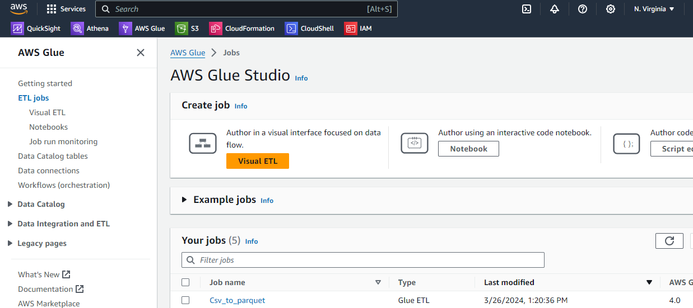

# aws-data-engineering

### Note
> **Disclaimer:** Please note that while using any AWS service, you may incur costs associated with data usage, network charges, or other expenses. We want to emphasize that we are not responsible for any costs that may arise from your use of this service. It is your responsibility to be aware of and manage any associated costs.

### Objectives

This project will help you exercise your skills in and will serve as references related to AWS Glue and Spark, integrated with S3 and Athena

This simple project contains is a Spark script to be executed in AWS Glue
the objective is to show how to programatically transform a CSV file into Parquet
Change YOUR_BUCKET_NAME with the working bucket for source and destination, 
it does not need to be the same bucket as long as your Glue job has the correct IAM role to acess the bucket(s)
 
The code in [csv-to-parquet-glue.py](csv-to-parquet-glue.py) is based on the datasets provided in the AWS workshop below:

https://catalog.us-east-1.prod.workshops.aws/athena-immersion-day/en-US/30-basics/300-view-datasets


Sample data can be found at:

 - s3://ws-assets-prod-iad-r-iad-ed304a55c2ca1aee/9981f1a1-abdc-49b5-8387-cb01d238bb78/v1/csv/customers.csv
 - s3://ws-assets-prod-iad-r-iad-ed304a55c2ca1aee/9981f1a1-abdc-49b5-8387-cb01d238bb78/v1/csv/sales.csv 
 
To download the files use the following commands in your local machine using AWS CLI:

```powershell
aws s3 cp s3://ws-assets-prod-iad-r-iad-ed304a55c2ca1aee/9981f1a1-abdc-49b5-8387-cb01d238bb78/v1/csv/customers.csv ./customers.csv


aws s3 cp s3://ws-assets-prod-iad-r-iad-ed304a55c2ca1aee/9981f1a1-abdc-49b5-8387-cb01d238bb78/v1/csv/sales.csv ./sales.csv
```

### Setting up your resources

1 - Your glue interface should have the following, notice that we created 




